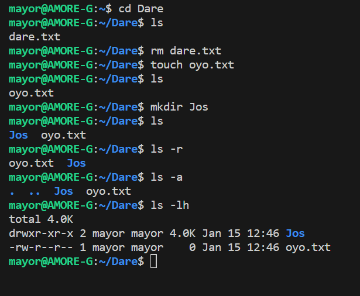

# Linux project for commands

## 1. 'sudo' commands 

#### Definition: Sudo is short for superuser do. It's a tool that elevates a user's privileges to execute sensitive commands, e.g. installing or updating a package, disabling a network interface, performing a restart, stopping the firewall daemon, modifying the crontab, or installing an application and updates.

#### To run a command requiring root privileges in a terminal, prepend sudo before it. To get an interactive root shell, use sudo -i.e.g  update the Linux OS

## 2. 'CD' command

#### Definition: The cd command in Linux stands for change directory. It is used to change the current directory of the terminal. The terminal, by default, opens the home directory. The cd command comes as part of the GNU Core Utilities, available on all Unix-like operating systems. The cd command, also known as chdir (change directory), is a command-line shell command used to change the current working directory in various operating systems. You don't have to close directories in a terminal, but you can always navigate away from a location you've made your current directory. The cd command, issued alone with no arguments, takes you back home.

### The cd command in Linux has the following syntax:

cd [options] [directory]

In the command above:

cd: Invokes the cd command.

[options]: Options change the way the command executes.

[directory]: Path to the directory you want to move into.

## 3. 'pwd' command

#### Definition: The pwd Linux command prints the current working directory path, starting from the root (/). Use the pwd command to find your way in the Linux file system structure maze or to pass the working directory in a Bash script.

Table of Content

## Syntax of `pwd` command in Linux

Flags For Specific behavior in `pwd` command in Linux.

How to Display the Current Working Directory in Linux

Syntax of `pwd` command in Linux

The basic syntax of the ‘pwd’ command is

## pwd [OPTIONS]

This command doesn’t have any arguments or options, but it can accept flags for specific behavior. 

## Flags For Specific behavior in 'pwd' command in Linux.

The “-L” flag resolves symbolic links and prints the path of the target directory.

The default behavior of the shell built-in “pwd” is equivalent to using “pwd -L”.

Mention the “-P” flag, which displays the actual path without resolving symbolic links.

The default behavior of the binary “/bin/pwd” is the same as using “pwd -P”

pwd -L: Prints the symbolic path. 

pwd -P: Prints the actual path.

## 4.'ls' command

#### The ls command is one of the more basic commands in Linux. It is designed to list the names and features of files and directories. It can be used for a single file or as many as all files and folders in a selected set of directories.

Syntax of `ls` command in Linux

ls [option] [file/directory] 

Commonly Used Options in `ls` command in Linux

# 5. 'cp' commands 

#### Definition: The cp command is used to copy one or more files on a Linux system to a new location. It is similar to the mv command, except it does not move or remove the original file, which remains in place. Like most Linux commands,
cp is run using the command line of a system terminal.

The cp command allows users to copy a file to either the same directory or a different location. Giving the copy a different name than the original file is also possible. 
The -r option enables the cp command to operate recursively and copy a directory and any files and subdirectories it contains. cp has several options, allowing users to run it interactively, use verbose mode, or preserve the file attributes of the original.

Users must have sudo privileges to copy protected files.

## Syntax of cp Command

The basic syntax for copying a file using the cp command is as follows:

cp source_file destination

   a. Copying Between Two Files in Linux

If the `cp` command contains two file names, it copies the contents of the first file to the second file. If the second file doesn’t exist, it is created, and the content is copied into it. However, if the second file already exists, it is overwritten without warning.

cp Src_file Dest_file

If `Dest_file` does not exist, it is created.
If `Dest_file` already exists, it is overwritten without any warning.

# 6. cat commands 

### Definition: The cat command is one of the most useful Linux commands you can learn. It derives its name from the word concatenate and lets you create, merge, or print files in the standard output screen or to another file and much more.

# 6. mv commands 

### Definition: Use the mv command to move files and directories from one directory to another or to rename a file or directory. If you move a file or directory to a new directory without specifying a new name, it retains its original name. Attention: The mv command can overwrite many existing files unless you specify the -i flag.

## Syntax
To Move and Rename a File

mv [ -d ] [ -e ] [ -E{force|ignore|warn} ] [ -i | -f ] [ -I ] SourceFile ... TargetFile

To Move and Rename a Directory

mv [ -d ] [ -e ] -E{force|ignore|warn} ] [ -i | -f ] [ -I ] SourceDirectory ... TargetDirectory

To Move Files or Directories to a Directory Maintaining Original File Names

mv [ -d ] [ -e ] -E{force|ignore|warn} ] [ -i | -f ] [ -I ] SourceFile/SourceDirectory

